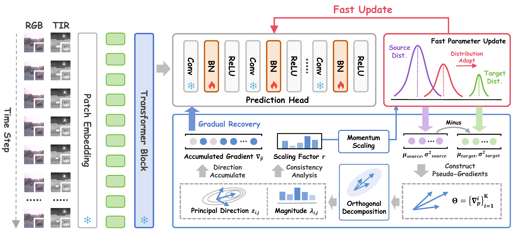

# PURA: Parameter Update-Recovery Test-Time Adaption for RGB-T Tracking

<p align="center">
  📖<a href="https://melantech.github.io/PURA/" target="_blank">[Project Page]</a> 
</p>

This is the official repository for **PURA: Parameter Update-Recovery Test-Time Adaption for RGB-T Tracking** (CVPR 2025).

<div style="text-align: center;">
  
</div>

## Introduction

✨ PURA is a test-time adaptation framework for RGB-T tracking, designed to robustly adapt to domain transition scenarios during the testing process.

✨ PURA adapts online through parameter update and recovery mechanisms, avoiding drastic parameter changes and heavy computational burden.

## Results

We have released the results of our method on the RGBT234, RGBT210 and GTOT datasets:

<table style="text-align: center;">
  <tr>
    <th rowspan="2">Method</th>
    <th colspan="2">RGBT234</th>
    <th colspan="2">RGBT210</th>
    <th colspan="2">GTOT</th>
    <th rowspan="2">FPS</th>
    <th rowspan="2">Raw Result</th>
  </tr>
  <tr>
    <th>MPR(%)</th>
    <th>MSR(%)</th>
    <th>PR(%)</th>
    <th>SR(%)</th>
    <th>MPR(%)</th>
    <th>MSR(%)</th>
  </tr>
  <tr>
    <td>No Adapt.</td>
    <td>90.8</td>
    <td>67.6</td>
    <td>88.6</td>
    <td>65.1</td>
    <td>95.1</td>
    <td>78.2</td>
    <td>59.5</td>
    <td><a href="https://drive.google.com/drive/folders/19ojw2JUciB-R9WdNFxwtrnVR0FPQGhFC?usp=sharing" target="_blank">Google Drive</a></td>
  </tr>
  <tr>
    <td>PURA</td>
    <td>93.3</td>
    <td>70.3</td>
    <td>90.3</td>
    <td>66.8</td>
    <td>95.7</td>
    <td>78.6</td>
    <td>42.0</td>
    <td><a href="https://drive.google.com/drive/folders/19ojw2JUciB-R9WdNFxwtrnVR0FPQGhFC?usp=sharing" target="_blank">Google Drive</a></td>
  </tr>
</table>

* Note: The full code and weights of our method will be released soon.

## Usage

For applying PURA to your own RGB-T tracker based on [pytracking](https://github.com/visionml/pytracking), you can follow the steps below:

1. Copy `pura.py` to `lib\test\tracker` folder.
2. Modify `lib\test\tracker\xxx_track.py` to include the following code:

```python
from lib.test.tracker import pura  # import PURA
from lib.test.tracker import teny  # import Tent
from lib.test.tracker import eata  # import EATA
from lib.test.tracker import adabn  # import AdaBN
...


class XXXTrack(BaseTracker):
    def __init__(self, params, dataset_name):
        super(XXXTrack, self).__init__(params)
        network = build_xxx_track(params.cfg, training=False)
        network.load_state_dict(torch.load(self.params.checkpoint, map_location='cpu')['net'], strict=True)
        self.cfg = params.cfg
        self.network = network.cuda()
        self.network.eval()

        # PURA
        pura.replace_batchnorm(self.network.box_head)  # replace batchnorm in box_head with PURA
        self.network = pura.configure_model(self.network)  # configure model
        
        # Tent
        # model = tent.configure_model(self.network)
        # tta_params, tta_param_names = tent.collect_params(model.box_head)
        # optimizer = torch.optim.AdamW(tta_params, lr=1e-3)
        # self.model = tent.Tent(model, optimizer)
        
        # ETA
        # model = eata.configure_model(self.network)
        # tta_params, tta_param_names = eata.collect_params(model.box_head)
        # optimizer = torch.optim.SGD(tta_params, lr=0.00025, momentum=0.9)
        # self.model = eata.EATA(model, optimizer, e_margin=math.log(1000)*0.40, d_margin=0.05)
        
        # AdaBN
        # adabn.replace_batchnorm(self.network.box_head)
        # self.network = adabn.configure_model(self.network)

        self.preprocessor = Preprocessor()
        self.state = None
        ...
```
3. If `Tent` or `ETA` is enabled, please build the data as a dictionary input model of the `track` function in `lib\test\tracker\xxx_track.py`:
```python
    def track(self, image, info: dict = None):
        H, W, _ = image.shape
        self.frame_id += 1
        
        ...

        with torch.enable_grad():  # Don't forget to enable grad
            model_inputs = {
                "template": cur_template,
                "search": [x_dict.tensors[:, :3, :, :], x_dict.tensors[:, 3:, :, :]],
                "ce_template_mask": self.box_mask_z
            }
            
            out_dict = self.model(model_inputs)
```

## Acknowledgments

We use the implementation of the SVD decomposition from the [PGrad](https://github.com/QData/PGrad) repo.

## Citation

If our work is helpful for your research, please consider citing our paper:

```bibtex
@inproceedings{shao2025pura,
    title={PURA: Parameter Update-Recovery Test-Time Adaption for RGB-T Tracking},
    author={Shao, Zekai and Hu, Yufan and Fan, Bin and Liu, Hongmin},
    booktitle={Proceedings of the Computer Vision and Pattern Recognition Conference},
    pages={22089--22098},
    year={2025}
}
```